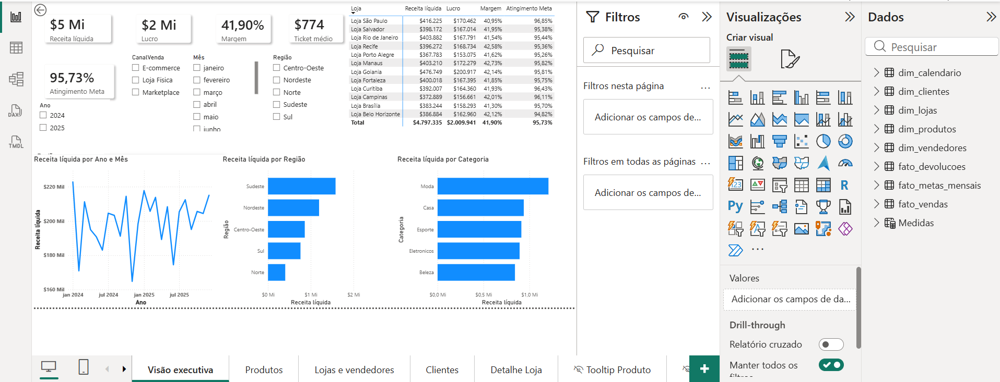
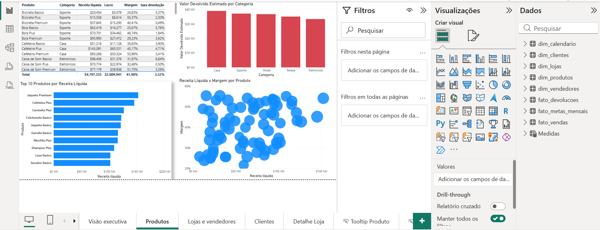
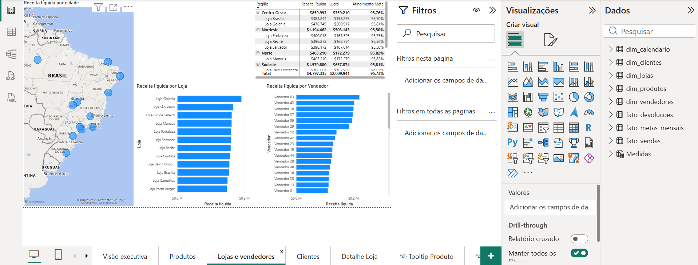
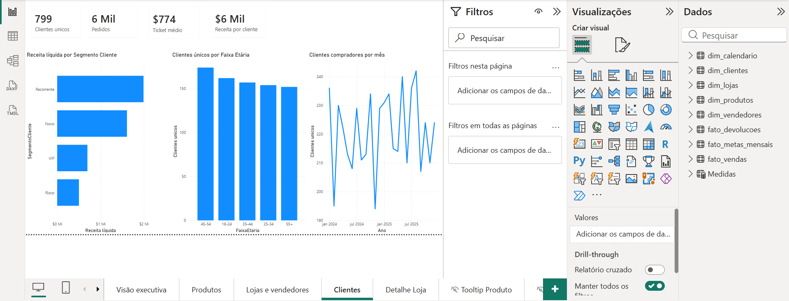
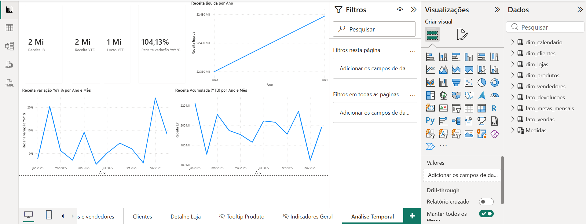

# 📊 Dashboard de Vendas — Varejo Omnichannel (Power BI)

Projeto de portfólio para praticar modelagem de dados, DAX e design de dashboards em Power BI, simulando a operação de vendas de uma empresa fictícia de varejo omnicanal.

**Base:** 10.284 vendas | 800 clientes | 75 produtos | 12 lojas

---

## 🎯 Objetivo

Construir um dashboard executivo e analítico capaz de responder perguntas reais de negócio:
- A empresa está vendendo bem e batendo meta?
- Quais produtos geram crescimento, margem e problemas de devolução?
- Quais lojas e vendedores puxam o resultado?
- Quais segmentos de clientes compram mais e com melhor ticket?

---

## 🖥️ Páginas do Dashboard

### Visão Executiva
Cards de Receita Líquida, Lucro, Margem, Ticket Médio e Atingimento de Meta, evolução mensal, receita por região e categoria, matriz por loja e segmentadores de Ano/Mês/Região/Canal.

### Produtos
Top 10 produtos por receita, dispersão Receita x Margem, devoluções por categoria (com cor de alerta) e tabela analítica completa.

### Lojas e Vendedores
Mapa de receita por cidade, ranking de lojas e vendedores, e matriz Região → Loja com atingimento de meta.

### Clientes
Cards de clientes únicos, pedidos e ticket médio, receita por segmento, distribuição por faixa etária e tendência de compradores por mês.

### Análise Temporal (bônus)
Receita do ano anterior, receita acumulada (YTD), variação percentual ano a ano (YoY) — recursos de DAX intermediário aplicados à leitura de tendência.

---

## ⚙️ Destaques Técnicos

- **Modelagem:** modelo estrela com 3 tabelas fato e 5 dimensões, `dim_calendario` marcada como tabela de datas.
- **DAX:** medidas de receita, custo, lucro, margem, ticket médio, meta com `TREATAS`, receita do ano anterior, YTD e variação YoY.
- **Recursos intermediários:** drill-through de loja e tooltip customizado de produto (páginas de apoio ocultas na navegação principal).
- **Resolução de ambiguidade de relacionamento:** o modelo continha um caminho ambíguo entre `fato_vendas`, `dim_lojas` e `dim_vendedores`. Foi necessário desativar o relacionamento `dim_vendedores → dim_lojas` e ativar `fato_vendas → dim_vendedores` diretamente, resolvendo tanto os valores agregados incorretos quanto a falta de cross-filtering no gráfico de vendedores.

---

## 📂 Estrutura do Repositório

- `dashboard.pbix` — arquivo do Power BI (abrir no Power BI Desktop)
- `dados/` — arquivos CSV originais
- `scripts/` — script para recriar a base de dados
- `documentos/` — roteiro de estudo, modelo de dados e roteiro do dashboard
- `imagens/` — prints das páginas do relatório

---

## 🚀 Como abrir o projeto

1. Baixe o arquivo `dashboard.pbix`
2. Abra no [Power BI Desktop](https://www.microsoft.com/pt-br/power-platform/products/power-bi/downloads) (gratuito)
3. Navegue pelas páginas visíveis na barra inferior
4. Para ver os recursos de drill-through e tooltip customizado: clique com o botão direito em qualquer loja no gráfico "Receita por Loja" (página Lojas e Vendedores), ou passe o mouse sobre um produto no gráfico "Top 10 Produtos" (página Produtos)

> 💡 O relatório possui páginas de apoio ocultas na navegação (drill-through e tooltip). Isso é intencional — elas são acessadas por interação, não como abas diretas.

---

## 📖 Documentação do processo

Para quem quiser entender o passo a passo de construção, desde a modelagem até o roteiro de DAX:
- [`documentos/roteiro_dashboard.md`](documentos/roteiro_dashboard.md) — escopo funcional de cada página
- [`documentos/modelo_dados.md`](documentos/modelo_dados.md) — modelo de dados e relacionamentos
- [`documentos/roteiro_estudo.md`](documentos/roteiro_estudo.md) — roteiro de estudo por fases (fundamentos → DAX → recursos intermediários)
